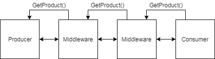

IPTVUtils
===
IPTV utilities for recording, playing and converting MPEG TS over IP

Features
---
-  Windows and Linux
- Pcap and Pcap-ng files
- Playback loop with PCR and CC correction
- Changing destination of recorded trafic
- Packet and TS analytics
- IGMP
- VLAN (802.1q, 802.1ad)
- UDP, RTP, RTP_FEC with automatic detection

Building
===
Built using Qt 5.9 and Visual Studio 2017 compiler.
Installer requires NSIS 3 or later and prerequisites are inside the folder "installer/Prerequisites", not provided in this repo.
- Microsoft Visual C++ 2017 Redistributable (x64) - 14.10.25017
- WinPcap 4.1.3 installer

For pcap-ng support https://sourceforge.net/projects/winpcap413-176/ is used, install on local machine for development and distribute with program for releases. Comes in 64-bit flavor under installer/dependencies64 catalog

Modules
===
Modules are the parts that form a chain from Source to Output.  
As many different configurations are possible: (File->Network, Network->File, File->File and Network->Network ) IPTVUtils was designed to be very dynamic in how these modules could be paired.

By designing eg. Playback as a chain of modules we can design independent modules that only perform one task, reducing coupling and increasing coherence.

Two types of modules are required for a meaningful chain, the *Producer* is the start of the module chain, supplies data from file or network to be used by other modules, only one can exist in a configuration.
At the end of the chain we usually have the *Consumer*, used to output data to file or out on the network.

In addition to producers and comsumers we have *Middleware*, they are modules in between the producer and the consumer, they can perform analytics, filtering or any other computation/manipulation of the data.

Modules should be designed to be running in a worker thread and buffer output to minimize latency and performance loss.

Data
---
All data that is collected from network or pcap file can be filtered the same way as Wireshark or tcpdump, libpcap is using a Berkeley Packet Filter (BPF) that compiles when record or playback is started and filters data before it reaches our application. The data that pass through this filter needs to be passed around between modules, therefor a container class was made to hold references to that data and only pass references around.

Libpcap exposes all data between MAC destination to the end of packet and also gives meta information about packets such as size and time of arrival. This meta data is used to deliver packets in the same pace as it was once recieved and is critical for accurate playback. To store this data we use the container class PcapProduct, this name is chosen from the module pattern where products are the result of a Producer.

Communication
---
The chain of modules is double linked to allow middleware and consumers to request new data from the previous module. This is in difference to how data usually flow through middleware, being pushed through. An atempt was made to implement data flow this way but due to simplicity this "reverse" flow was chosen.

Module details
===
The different modules are listed below with a short description of what they do.

Producers
---
### PcapBufferedProducer
Collects data from either a pcap file or a network adapter.

Consumers
---
### PcapFileConsumer
Saves data to file in .pcap format.

### TsFileConsumer
Saves data to file in .ts format.

### PcapNetworkConsumer
Used for playing packets onto the network. Can rewrite ethernet, ip and udp headers to change destination and source.

Middleware
---
### AnalyzerPcapMiddleware
Performs analyzation of IP packets and TS packets (TS 101 290).

### LoopPcapMiddleware
Handles loops, indicates loops, rewrites TS packets to indicate discontinuity or recalulates PCR and CC values to be valid on looped data.
